# EPUB Export Pipeline

```mermaid
flowchart TD
    %% Entry
    A[User requests EPUB export] --> B[routes.ts: ensureSavedToS3]
    B --> C[Download .docx from S3]
    C --> D[convertDocxToEpub]

    %% Pre-pandoc
    D --> E{Exclude sections?}
    E -->|Yes| F[section-remover.ts\nRemove heading ranges from docx]
    E -->|No| G[font-assignment-extractor.ts\nExtract body & heading font names]
    F --> G

    G --> H[docx-preprocessor.ts]

    subgraph preprocess [Docx Preprocessing]
        H --> H1[Preserve empty paragraphs\nInsert nbsp so pandoc keeps them]
        H1 --> H2{Convert section breaks?}
        H2 -->|Yes| H3[Replace w:sectPr with\n«PAGEBREAK» marker paragraphs]
        H2 -->|No| H4{Remove soft returns?}
        H3 --> H4
        H4 -->|Yes| H5[Strip w:br from\ntext-containing paragraphs]
        H4 -->|No| H6[Promote direct formatting\nCreate euro-center/right/left styles\nfor paragraphs with direct w:jc]
        H5 --> H6
    end

    %% Font resolution
    H6 --> I[font-extractor.ts\nFind all fonts referenced in docx]
    I --> J[font-resolver.ts\nMatch fonts to files on disk\nusing font-mappings.json]

    %% Style map
    H6 --> K[style-map-generator.ts\nParse styles.xml → JSON map\nstyleName → CSS string]

    %% Pandoc
    J --> L[Pandoc]
    K --> L

    subgraph pandoc [Pandoc Conversion]
        L --> L1[pandoc -f docx+styles]
        L1 --> L2[inject-styles.lua\nDiv handler: apply inline CSS\nfrom style map to paragraphs]
        L1 --> L3[inject-styles.lua\nHeader handler: apply\ntext-align to headings]
        L2 --> L4[epub-styles.css\nBase stylesheet: resets,\ndefault indent, heading sizes]
        L3 --> L4
    end

    L4 --> M[output.epub]

    %% Post-pandoc
    M --> N{Embed fonts?}
    N -->|Yes| O[epub-font-injector.ts\nEmbed font files in epub zip]
    O --> P[xhtml-font-injector.ts\nAdd @font-face declarations\nSet font-family on body & headings]
    N -->|No| Q{Section breaks converted?}
    P --> Q

    Q -->|Yes| R[epub-page-splitter.ts\nSplit XHTML at «PAGEBREAK» markers\ninto separate files]
    Q -->|No| S[Final .epub returned to user]
    R --> S

    %% Styling
    style preprocess fill:#1a1a2e,stroke:#e94560,color:#fff
    style pandoc fill:#16213e,stroke:#0f3460,color:#fff
```



## Key Data Flows

```mermaid
flowchart LR
    subgraph inputs [Inputs]
        DOCX[word/document.xml]
        STYLES[word/styles.xml]
        FONTS[/data/fonts\n/data/core-fonts]
        MAPPINGS[font-mappings.json]
        CSS[epub-styles.css]
    end

    subgraph intermediate [Intermediate Artifacts]
        STYLEMAP[style-map.json\nbodyFont + per-style CSS]
        PROMOTED[Synthetic styles\neuro-center/right/left\nin modified styles.xml]
        RESOLVED[Resolved font file paths]
    end

    subgraph output [Final EPUB Contents]
        XHTML[XHTML with inline styles]
        EMBFONTS[Embedded .ttf/.otf files]
        FONTFACE[@font-face declarations]
        BASECSS[epub-styles.css]
    end

    DOCX --> PROMOTED
    STYLES --> PROMOTED
    STYLES --> STYLEMAP
    PROMOTED --> STYLEMAP
    FONTS --> RESOLVED
    MAPPINGS --> RESOLVED

    STYLEMAP -->|Lua filter reads| XHTML
    CSS --> BASECSS
    RESOLVED --> EMBFONTS
    RESOLVED --> FONTFACE
```
